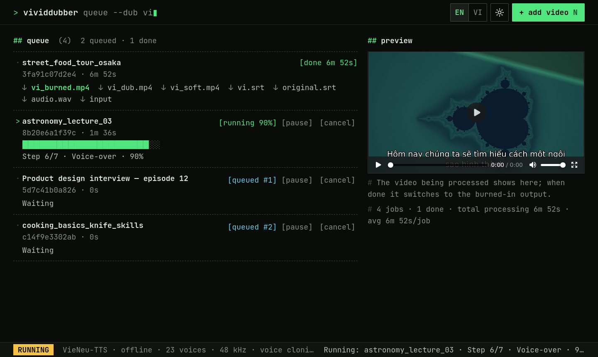
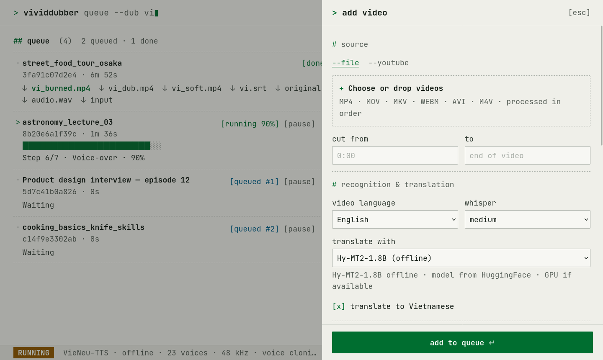
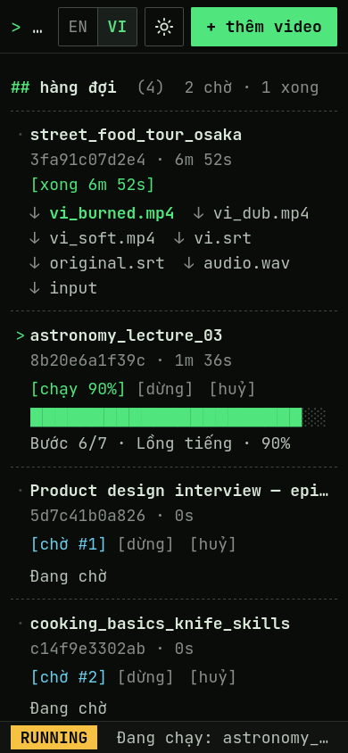
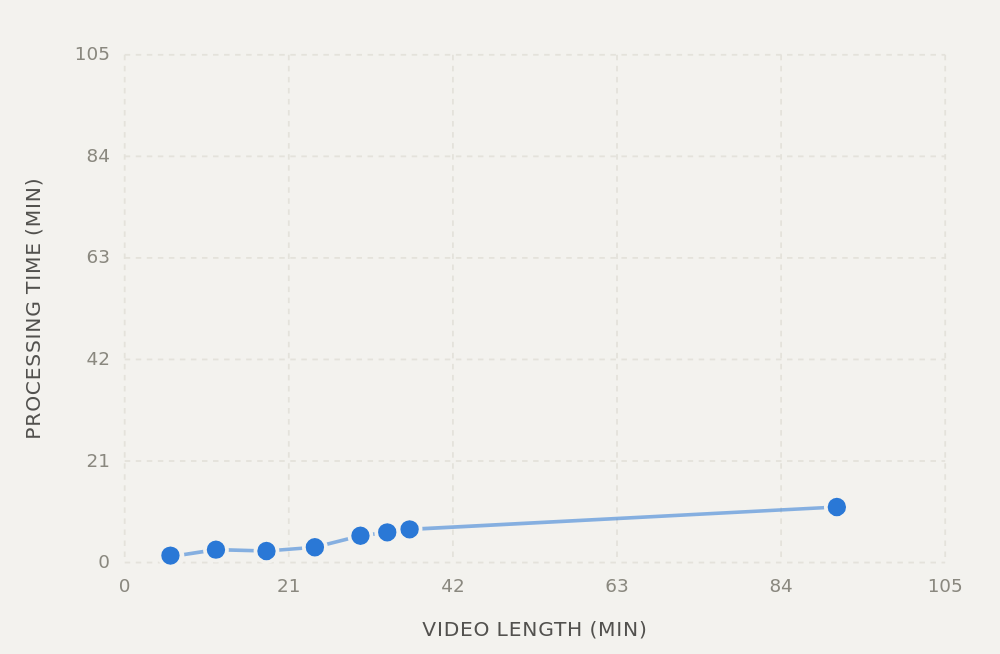
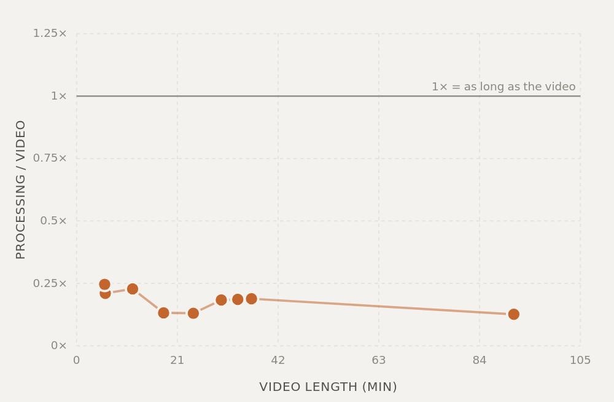

<h1 align="center">Vietnamese AI Video Dubber</h1>

<p align="center">Fully local, fully free Vietnamese video dubbing — Whisper transcription, AI translation, and VieNeu-TTS / Edge-TTS voice-over. No API keys, no cloud.</p>

<p align="center">
English | <a href="README_vi.md">Tiếng Việt</a>
</p>



<p align="center">

&nbsp;

</p>

Turns foreign-language videos (English, Chinese, Japanese) into videos with Vietnamese subtitles and a Vietnamese voice-over. Everything runs on your own machine; with the offline engines nothing leaves it.

```text
video -> (optional cut) -> audio -> subtitles (Whisper) -> translate to Vietnamese -> voice-over (VieNeu-TTS / Edge-TTS) -> MP4 with burned-in Vietnamese subtitles
```

## Features

- **Speech-to-text**: Faster-Whisper on GPU (falls back to CPU), source language English, Chinese or Japanese.
- **Translation**: HuggingFace Hy-MT2-1.8B (offline, 4-bit, default), Google Translate (online, free), or EnViT5 (offline, English only).
- **Voice-over**: VieNeu-TTS (offline, 23 Vietnamese voices, voice cloning, default) or Edge-TTS (online, 2 voices). Clips are fitted to the subtitle timing automatically.
- **Video**: burned-in Vietnamese subtitles (NVENC when available), soft-subtitle MP4, optional cut (start/end time), horizontal flip, a blur band to hide the source video's own subtitles, and a "Cre: <channel>" source credit.
- **Subtitles only**: untick the voice-over option to get burned Vietnamese subtitles over the original audio.
- **Batch queue**: many files or a whole YouTube playlist, processed one by one; pause / resume / cancel; download all results as a zip.
- **Web UI**: English / Vietnamese interface, dark / light theme.
- **No paid APIs.**

## Performance

Real runs from `jobs/stats.json` (end-to-end job time: transcription, translation, voice-over, burn-in), default settings: Whisper on GPU, Hy-MT2 on GPU, VieNeu-TTS on GPU.

| Video length | Processing time | Ratio |
|---|---|---|
| 5 min 59 s | 1 min 15 s | 0.21× |
| 24 min 20 s | 3 min 10 s | 0.13× |
| 30 min 10 s | 5 min 32 s | 0.18× |
| 33 min 36 s | 6 min 15 s | 0.19× |
| 36 min 27 s | 6 min 52 s | 0.19× |
| 91 min 8 s | 11 min 30 s | 0.13× |

| Processing time vs. video length | Processing time / video length |
|---|---|
|  |  |

The charts (from the "Benchmark Thuyết Minh" page) plot the 9 GPU jobs of 5 minutes or longer recorded since 2026-10-02, after the speed-up commits. Every dot is below the 1× line, i.e. faster than the video plays.

A 30-minute video takes about 5–7 minutes. The first job after starting the server is slower (models load: ~11 s translator, ~13 s VieNeu).

**Test machine:**

| Component | Spec |
|---|---|
| GPU | NVIDIA GeForce RTX 3050 Laptop GPU (4 GB VRAM) |
| CPU | Intel Core i5-11400H (12 threads) |
| RAM | 16 GB |
| CUDA / driver | CUDA 12.6, driver 615.71.09 |
| PyTorch | 2.14.0+cu126 |

Every finished dub job appends a row to `jobs/stats.json` (video length, processing time, GPU, devices, providers); `GET /api/stats` reads it back.

## Requirements

| Component | Required | Notes |
|---|---|---|
| Python | ✔ | ≥ 3.10, < 3.14 |
| [uv](https://docs.astral.sh/uv/) | ✔ | Package + virtualenv management |
| [ffmpeg](https://ffmpeg.org/) | ✔ | Video/audio processing |
| NVIDIA GPU (CUDA) | ✖ | Strongly recommended (4 GB is enough); everything also runs on CPU, much slower |
| Internet | Setup only | Install and first model download; Google Translate, Edge-TTS and YouTube links need it every time |

Platform install:

```bash
# Ubuntu/Debian
sudo apt update && sudo apt install -y ffmpeg git
curl -LsSf https://astral.sh/uv/install.sh | sh

# macOS (Homebrew)
brew install ffmpeg git
curl -LsSf https://astral.sh/uv/install.sh | sh

# Windows: get ffmpeg at https://ffmpeg.org/download.html
# then uv:  powershell -c "irm https://astral.sh/uv/install.ps1 | iex"
```

## Install & run

```bash
git clone https://github.com/ledangquangdangquang/ViVidDubber
cd ViVidDubber
uv sync --frozen               # installs all dependencies (incl. VieNeu-TTS)
uv run python app.py           # start the server
```

> `uv sync --frozen` uses the lock file, which avoids `vieneu` resolution errors on some machines.

Open **http://127.0.0.1:8787**.

## Using the web UI

1. Press **+ add video** (or the `N` key). A side sheet opens with all options.
2. Pick the **source**: local files (several at once) or a YouTube link/playlist (press *analyze*, then tick the videos you want).
3. Optionally set **cut from / to** (`90`, `1:30`, `1:02:03`) to process only part of the video.
4. Set the **video language** (English / Chinese / Japanese). This matters: with the wrong language Whisper translates into it first and quality drops.
5. Adjust subtitles (font size, blur the original subtitles at the bottom, flip, show the source name) and voice-over (original audio level, default 10 %; voice level; engine; voice — press *listen* to preview).
6. Press **add to queue**. Jobs run one at a time; each row shows the current step (`Step 6/7 · Voice-over · 90%`) and `[pause] [resume] [cancel]`.
7. Download the results from the job row:

| File | Content |
|---|---|
| `vi_burned.mp4` | Vietnamese voice-over + burned-in Vietnamese subtitles (main output) |
| `vi_dub.mp4` | Vietnamese voice-over + soft subtitles |
| `vi_soft.mp4` | Original audio + soft Vietnamese subtitles |
| `vi.srt` / `original.srt` | Vietnamese / original subtitles |
| `audio.wav`, `input` | Extracted audio, source video |

Files live in `jobs/<job-id>/`. The `EN | VI` and sun/moon buttons in the top bar switch the interface language and theme (both remembered by the browser).

## Where do downloaded models go?

Whisper, Hy-MT2-1.8B, EnViT5 and VieNeu-TTS download automatically on first use via Hugging Face Hub, into the shared cache:

- Linux/macOS: `~/.cache/huggingface/hub/`
- Windows: `%USERPROFILE%\.cache\huggingface\hub\`

Each model gets its own `models--<org>--<name>/` folder, e.g. `models--Systran--faster-whisper-medium`, `models--tencent--Hy-MT2-1.8B`, `models--VietAI--envit5-translation`, `models--pnnbao-ump--VieNeu-TTS-v3-Turbo`. Nothing downloads until you run a job with that engine. Set `HF_HOME` before `uv run python app.py` to move the cache.

## Source languages

| Language | Whisper | Translation |
|---|---|---|
| English (default) | ✔ | Hy-MT2, Google, EnViT5 |
| Chinese | ✔ | Hy-MT2, Google |
| Japanese | ✔ | Hy-MT2, Google |

For Chinese and Japanese, Whisper gets a punctuation prompt on every 30 s window (without it, it drops all punctuation and writes Traditional Chinese), and sentences are cut at `。？！` with shorter length limits. EnViT5 only translates from English; the UI disables it for other languages.

## Translation models — which one?

| | Hy-MT2-1.8B (default) | Google Translate | EnViT5 |
|---|---|---|---|
| **API key** | None | None | None |
| **Internet while running** | No | Yes | No |
| **Download size** | ~3.5 GB | 0 | ~2.1 GB |
| **VRAM** | ~1.2 GB (4-bit) | — | GPU optional |
| **Quality** | Best | Good | OK |
| **Source languages** | EN, ZH, JA | EN, ZH, JA | EN only |

The offline translator stays loaded between jobs, so only the first job pays the load time.

### Hy-MT2-1.8B

Runs `tencent/Hy-MT2-1.8B` directly with Transformers, **4-bit quantized** by default (bitsandbytes): ~1.2 GB VRAM instead of ~3.4 GB.

| Variable | Default | Description |
|---|---|---|
| `HF_TRANSLATE_REPO` | `tencent/Hy-MT2-1.8B` | HuggingFace model repo (e.g. `tencent/Hy-MT2-7B`: slower, better) |
| `HF_TRANSLATE_BATCH_SIZE` | `20` | Lines translated per call |
| `HF_TRANSLATE_DEVICE` | auto | `cpu` or `cuda`; the UI's "translation (offline)" device wins for UI jobs |
| `HF_TRANSLATE_QUANT` | `4bit` | `4bit` or `none` (FP16) |

### Google Translate

Free endpoint, no key. Lines are sent in chunks of 20 with retries; a line that still fails keeps its original text and shows up as a warning on the job.

### EnViT5

Offline `VietAI/envit5-translation`, English → Vietnamese only.

| Variable | Default | Description |
|---|---|---|
| `ENVIT5_MODEL` | `VietAI/envit5-translation` | HuggingFace model name |
| `ENVIT5_BATCH_SIZE` | `20` | Lines translated per call |

> If you see a triton CUDA compile error, set `CC=/usr/bin/gcc` before running (the code also sets this fallback itself).

## Whisper (speech recognition)

The UI sends the model (`medium` by default) and device (`GPU` by default, compute type `int8_float16`, ~1.2 GB VRAM). On a CUDA out-of-memory error the server first unloads the translator and retries on GPU, then falls back to CPU `int8`.

Environment variables are the defaults for API calls that don't send these fields:

| Variable | Default | Description |
|---|---|---|
| `WHISPER_DEVICE` | `cpu` | `cpu` or `cuda` |
| `WHISPER_COMPUTE_TYPE` | `int8` | `int8`, `int8_float16`, `float16`, `float32` (half-precision types are GPU-only; on CPU they become `int8`) |
| `WHISPER_BEAM_SIZE` | `1` | Higher = more accurate, slower |
| `SUBTITLE_MAX_CHARS` | `80` | Max characters per on-screen subtitle; translation and dubbing still use whole sentences |

## Voice-over (TTS)

| | VieNeu-TTS (default) | Edge-TTS |
|---|---|---|
| **Runs** | **Offline** (GPU or CPU) | Online (Microsoft) |
| **Voices** | **23** (North / Central / South) | 2 (Hoài My, Nam Minh) |
| **Audio** | **48 kHz** | 44.1 kHz |
| **Voice cloning** | ✅ 3–8 s sample, saved for reuse | ❌ |
| **Model size** | ~900 MB (first-run download) | 0 |

On GPU, VieNeu synthesizes all lines in one batch; on CPU it uses the ONNX backend. Clips longer than their subtitle slot are re-synthesized faster (Edge-TTS) or time-stretched.

Default mix: original audio at 10 %, Vietnamese voice at 200 %; set original audio to 0 % to replace it completely.

## Video output

- Burn-in uses `h264_nvenc` when the GPU encoder works, otherwise `libx264`. Force CPU with `BURN_ENCODER=libx264`.
- With voice-over on, the picture is burned while the voice-over is generated, then the audio is copied in.
- **Flip** mirrors the picture before the subtitles are drawn, so the subtitles stay readable. **Blur** (0–30 % of the height) blurs the bottom band under the new subtitles. **Source name** burns "Cre: <name>" in the top-left corner; for YouTube links the name is the channel, filled in when you press *analyze* and editable. All three apply to `vi_burned.mp4` only.

## API

- `POST /api/jobs`: create a job (multipart `file` + form options, or `video_url` for one YouTube video)
- `POST /api/resolve`: expand a YouTube link/playlist into per-video URLs
- `GET /api/queue`, `GET /api/jobs/{id}`: queue / job status
- `POST /api/jobs/{id}/pause`, `/resume`, `/cancel`: control a job
- `GET /api/jobs/{id}/download/{kind}`: download one result; `GET /api/jobs/download-all`: zip of all finished dubs
- `GET /api/config`, `GET /api/stats`: server config, benchmark rows
- `GET|POST /api/clone-voices`, `DELETE /api/clone-voices/{name}`: saved clone voices
- `POST /api/preview-voice`: short voice sample

Main `POST /api/jobs` fields: `source_lang` (`en`/`zh`/`ja`), `whisper_model`, `whisper_device`, `translation_provider` (`huggingface`/`google`/`envit5`), `translate_device`, `translate`, `dub`, `tts_provider` (`vieneu`/`edge`), `tts_voice`, `tts_device`, `background_volume` (0–1), `voice_volume`, `subtitle_font_size`, `trim_start`, `trim_end`, `flip`, `cover_bottom` (0–0.4), `show_source`, `source_credit`, `clone_ref_audio` / `clone_voice_name`.

## FAQ

**Some lines were not translated?**
They are listed as warnings on the job. Usually a Google rate limit; failed lines are retried one by one and, if they still fail, keep the original text instead of a wrong translation.

**The translation is poor / reads like a double translation?**
Check the video language. A Japanese video run as "English" is first translated to English by Whisper, then to Vietnamese.

**The job failed with "Whisper không nhận ra lời nói nào…"?**
The video (or the part you cut) has no speech, e.g. only music.

**File too large?**
2 GB per upload, at most 50 jobs; finished jobs are deleted after 6 hours.
