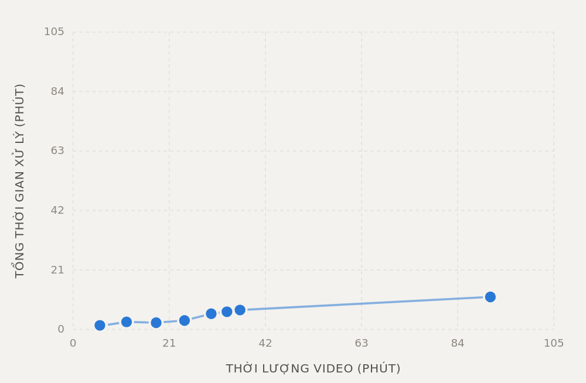
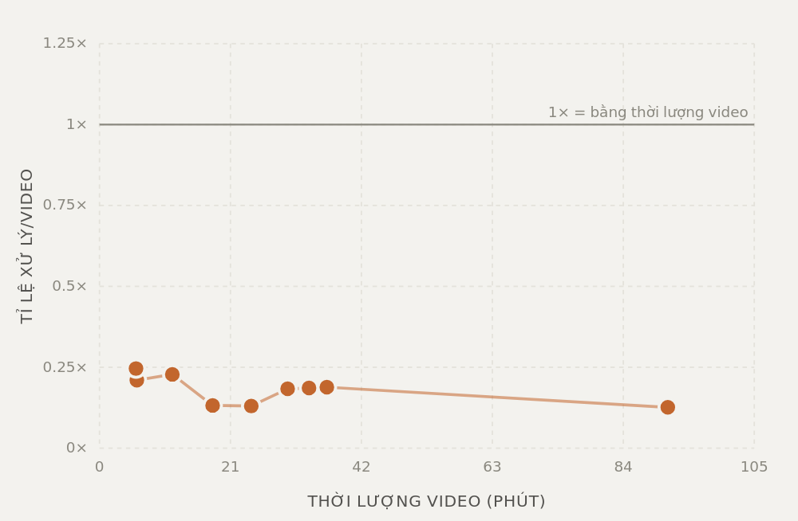

<h1 align="center">Vietnamese AI Video Dubber</h1>

<p align="center">Lồng tiếng video sang tiếng Việt, chạy hoàn toàn trên máy, hoàn toàn miễn phí — nhận diện Whisper, dịch AI, thuyết minh VieNeu-TTS / Edge-TTS. Không API key, không cloud.</p>

<p align="center">
<a href="README.md">English</a> | Tiếng Việt
</p>


<p align="center">

&nbsp;

</p>

Biến video tiếng nước ngoài (Anh, Trung, Nhật) thành video có phụ đề tiếng Việt và giọng thuyết minh tiếng Việt. Mọi thứ chạy trên máy của bạn; dùng các engine offline thì không có dữ liệu nào rời khỏi máy.

```text
video -> (cắt, tuỳ chọn) -> audio -> phụ đề (Whisper) -> dịch sang Việt -> lồng tiếng (VieNeu-TTS / Edge-TTS) -> MP4 có phụ đề Việt burn sẵn
```

## Tính năng

- **Nhận diện giọng nói**: Faster-Whisper chạy GPU (tự quay về CPU), ngôn ngữ nguồn Anh, Trung hoặc Nhật.
- **Dịch**: HuggingFace Hy-MT2-1.8B (offline, 4-bit, mặc định), Google Translate (online, miễn phí) hoặc EnViT5 (offline, chỉ từ tiếng Anh).
- **Lồng tiếng**: VieNeu-TTS (offline, 23 giọng Việt, clone giọng, mặc định) hoặc Edge-TTS (online, 2 giọng). Mỗi câu tự khớp với thời gian phụ đề.
- **Video**: burn phụ đề Việt (dùng NVENC nếu có), MP4 phụ đề mềm, cắt đoạn (thời điểm bắt đầu/kết thúc), lật ngang, làm mờ dải đáy để che phụ đề có sẵn của video gốc.
- **Chỉ phụ đề**: bỏ tick lồng tiếng để có video burn phụ đề Việt, giữ nguyên audio gốc.
- **Hàng đợi**: nhiều file hoặc cả playlist YouTube, chạy lần lượt; tạm dừng / tiếp tục / huỷ; tải tất cả kết quả thành file zip.
- **Giao diện web**: tiếng Anh / tiếng Việt, sáng / tối.
- **Không dùng API trả phí.**

## Hiệu năng

Số liệu thật từ `jobs/stats.json` (thời gian cả job: nhận diện, dịch, lồng tiếng, burn phụ đề), cấu hình mặc định: Whisper chạy GPU, Hy-MT2 chạy GPU, VieNeu-TTS chạy GPU.

| Độ dài video | Thời gian xử lý | Tỉ lệ |
|---|---|---|
| 5 phút 59 giây | 1 phút 15 giây | 0.21× |
| 24 phút 20 giây | 3 phút 10 giây | 0.13× |
| 30 phút 10 giây | 5 phút 32 giây | 0.18× |
| 33 phút 36 giây | 6 phút 15 giây | 0.19× |
| 36 phút 27 giây | 6 phút 52 giây | 0.19× |
| 91 phút 8 giây | 11 phút 30 giây | 0.13× |

| Thời gian xử lý theo độ dài video | Tỉ lệ xử lý / độ dài video |
|---|---|
|  |  |

Biểu đồ (lấy từ trang "Benchmark Thuyết Minh") vẽ 9 job chạy GPU, video từ 5 phút trở lên, ghi từ 2026-10-02 sau các commit tăng tốc. Mọi chấm đều nằm dưới đường 1×, tức xử lý nhanh hơn thời lượng video.

Video 30 phút mất khoảng 5–7 phút. Job đầu tiên sau khi khởi động server chậm hơn một chút vì phải nạp model (~11 giây cho model dịch, ~13 giây cho VieNeu).

**Cấu hình máy test:**

| Thành phần | Thông số |
|---|---|
| GPU | NVIDIA GeForce RTX 3050 Laptop GPU (4 GB VRAM) |
| CPU | Intel Core i5-11400H (12 luồng) |
| RAM | 16 GB |
| CUDA / driver | CUDA 12.6, driver 615.71.09 |
| PyTorch | 2.14.0+cu126 |

Mỗi job lồng tiếng xong sẽ thêm một dòng vào `jobs/stats.json` (độ dài video, thời gian xử lý, GPU, thiết bị, provider); đọc lại qua `GET /api/stats`.

## Yêu cầu hệ thống

| Thành phần | Bắt buộc | Ghi chú |
|---|---|---|
| Python | ✔ | ≥ 3.10, < 3.14 |
| [uv](https://docs.astral.sh/uv/) | ✔ | Quản lý package + môi trường ảo |
| [ffmpeg](https://ffmpeg.org/) | ✔ | Xử lý video/audio |
| GPU NVIDIA (CUDA) | ✖ | Rất nên có (4 GB là đủ); không có vẫn chạy được trên CPU nhưng chậm hơn nhiều |
| Internet | Chỉ lúc cài đặt | Cài đặt và tải model lần đầu; Google Translate, Edge-TTS và link YouTube thì cần mạng mỗi lần dùng |

Cài đặt nền tảng:

```bash
# Ubuntu/Debian
sudo apt update && sudo apt install -y ffmpeg git
curl -LsSf https://astral.sh/uv/install.sh | sh

# macOS (Homebrew)
brew install ffmpeg git
curl -LsSf https://astral.sh/uv/install.sh | sh

# Windows: tải ffmpeg tại https://ffmpeg.org/download.html
# rồi cài uv:  powershell -c "irm https://astral.sh/uv/install.ps1 | iex"
```

## Cài đặt và chạy

```bash
git clone https://github.com/ledangquangdangquang/ViVidDubber
cd ViVidDubber
uv sync --frozen               # cài toàn bộ dependencies (gồm VieNeu-TTS)
uv run python app.py           # khởi động server
```

> `uv sync --frozen` dùng lock file có sẵn, tránh lỗi phân giải `vieneu` trên một số máy.

Mở **http://127.0.0.1:8787**.

## Dùng giao diện web

1. Bấm **+ thêm video** (hoặc phím `N`). Một bảng trượt ra từ bên phải chứa mọi tuỳ chọn.
2. Chọn **nguồn**: file trên máy (chọn nhiều file cùng lúc) hoặc link/playlist YouTube (bấm *phân tích* rồi tick các video muốn chạy).
3. Có thể đặt **cắt từ / đến** (`90`, `1:30`, `1:02:03`) để chỉ xử lý một đoạn.
4. Chọn **ngôn ngữ video** (Anh / Trung / Nhật). Bước này quan trọng: chọn sai thì Whisper sẽ dịch sang ngôn ngữ đó trước và chất lượng giảm.
5. Chỉnh phụ đề (cỡ chữ, làm mờ phụ đề gốc ở đáy, lật video) và lồng tiếng (âm lượng audio gốc, mặc định 10%; âm lượng giọng Việt; engine; giọng đọc — bấm *nghe* để nghe thử).
6. Bấm **thêm vào hàng đợi**. Job chạy lần lượt; mỗi dòng hiện bước đang chạy (`Bước 6/7 · Lồng tiếng · 90%`) cùng `[dừng] [tiếp] [huỷ]`.
7. Tải kết quả ngay trên dòng của job:

| File | Nội dung |
|---|---|
| `vi_burned.mp4` | Giọng Việt + phụ đề Việt burn sẵn (kết quả chính) |
| `vi_dub.mp4` | Giọng Việt + phụ đề mềm |
| `vi_soft.mp4` | Audio gốc + phụ đề Việt mềm |
| `vi.srt` / `original.srt` | Phụ đề tiếng Việt / phụ đề gốc |
| `audio.wav`, `input` | Audio đã tách, video nguồn |

File nằm trong `jobs/<job-id>/`. Nút `EN | VI` và nút mặt trời/mặt trăng trên thanh trên cùng đổi ngôn ngữ giao diện và theme (trình duyệt tự nhớ lựa chọn).

## Model tải về nằm ở đâu?

Whisper, Hy-MT2-1.8B, EnViT5 và VieNeu-TTS tự tải qua Hugging Face Hub khi dùng lần đầu, vào cache dùng chung:

- Linux/macOS: `~/.cache/huggingface/hub/`
- Windows: `%USERPROFILE%\.cache\huggingface\hub\`

Mỗi model có một thư mục `models--<org>--<tên>/`, ví dụ `models--Systran--faster-whisper-medium`, `models--tencent--Hy-MT2-1.8B`, `models--VietAI--envit5-translation`, `models--pnnbao-ump--VieNeu-TTS-v3-Turbo`. Chưa chạy job với engine nào thì chưa tải engine đó. Muốn đổi chỗ lưu, đặt biến `HF_HOME` trước khi chạy `uv run python app.py`.

## Ngôn ngữ nguồn

| Ngôn ngữ | Whisper | Dịch |
|---|---|---|
| Tiếng Anh (mặc định) | ✔ | Hy-MT2, Google, EnViT5 |
| Tiếng Trung | ✔ | Hy-MT2, Google |
| Tiếng Nhật | ✔ | Hy-MT2, Google |

Với tiếng Trung và tiếng Nhật, Whisper nhận thêm một câu gợi ý dấu câu cho mỗi đoạn 30 giây (thiếu nó Whisper bỏ hết dấu câu và viết chữ phồn thể), và câu được cắt tại `。？！` với giới hạn độ dài ngắn hơn. EnViT5 chỉ dịch từ tiếng Anh nên giao diện khoá nó với các ngôn ngữ khác.

## Model dịch — chọn cái nào?

| | Hy-MT2-1.8B (mặc định) | Google Translate | EnViT5 |
|---|---|---|---|
| **API key** | Không | Không | Không |
| **Cần internet khi chạy** | Không | Có | Không |
| **Dung lượng tải** | ~3.5 GB | 0 | ~2.1 GB |
| **VRAM** | ~1.2 GB (4-bit) | — | GPU không bắt buộc |
| **Chất lượng** | Tốt nhất | Tốt | Khá |
| **Ngôn ngữ nguồn** | Anh, Trung, Nhật | Anh, Trung, Nhật | Chỉ tiếng Anh |

Model dịch offline được giữ trong bộ nhớ giữa các job, nên chỉ job đầu tiên mất thời gian nạp.

### Hy-MT2-1.8B

Chạy `tencent/Hy-MT2-1.8B` trực tiếp bằng Transformers, mặc định **lượng tử hoá 4-bit** (bitsandbytes): ~1.2 GB VRAM thay vì ~3.4 GB.

| Biến | Mặc định | Mô tả |
|---|---|---|
| `HF_TRANSLATE_REPO` | `tencent/Hy-MT2-1.8B` | Model trên HuggingFace (vd. `tencent/Hy-MT2-7B`: chậm hơn, dịch tốt hơn) |
| `HF_TRANSLATE_BATCH_SIZE` | `20` | Số dòng dịch mỗi lần gọi |
| `HF_TRANSLATE_DEVICE` | tự động | `cpu` hoặc `cuda`; với job từ giao diện, ô "dịch (offline)" được ưu tiên |
| `HF_TRANSLATE_QUANT` | `4bit` | `4bit` hoặc `none` (FP16) |

### Google Translate

Endpoint miễn phí, không cần key. Gửi theo từng cụm 20 dòng, có thử lại; dòng vẫn lỗi sẽ giữ câu gốc và hiện thành cảnh báo trên job.

### EnViT5

Model offline `VietAI/envit5-translation`, chỉ dịch Anh → Việt.

| Biến | Mặc định | Mô tả |
|---|---|---|
| `ENVIT5_MODEL` | `VietAI/envit5-translation` | Tên model trên HuggingFace |
| `ENVIT5_BATCH_SIZE` | `20` | Số dòng dịch mỗi lần gọi |

> Nếu gặp lỗi triton không biên dịch được CUDA, đặt `CC=/usr/bin/gcc` trước khi chạy (code cũng tự đặt fallback này).

## Whisper (nhận diện giọng nói)

Giao diện gửi model (mặc định `medium`) và thiết bị (mặc định `GPU`, kiểu tính `int8_float16`, ~1.2 GB VRAM). Khi GPU hết bộ nhớ, server gỡ model dịch ra rồi thử lại trên GPU, nếu vẫn lỗi thì chuyển sang CPU `int8`.

Biến môi trường là giá trị mặc định cho các lệnh gọi API không gửi những trường này:

| Biến | Mặc định | Mô tả |
|---|---|---|
| `WHISPER_DEVICE` | `cpu` | `cpu` hoặc `cuda` |
| `WHISPER_COMPUTE_TYPE` | `int8` | `int8`, `int8_float16`, `float16`, `float32` (các kiểu half-precision chỉ chạy GPU; trên CPU tự đổi thành `int8`) |
| `WHISPER_BEAM_SIZE` | `1` | Cao hơn = chính xác hơn, chậm hơn |
| `SUBTITLE_MAX_CHARS` | `80` | Số ký tự tối đa mỗi phụ đề trên màn hình; dịch và lồng tiếng vẫn dùng nguyên câu |

## Lồng tiếng (TTS)

| | VieNeu-TTS (mặc định) | Edge-TTS |
|---|---|---|
| **Chạy** | **Offline** (GPU hoặc CPU) | Online (Microsoft) |
| **Giọng** | **23** (Bắc / Trung / Nam) | 2 (Hoài My, Nam Minh) |
| **Audio** | **48 kHz** | 44.1 kHz |
| **Clone giọng** | ✅ mẫu 3–8 giây, lưu lại để dùng tiếp | ❌ |
| **Dung lượng model** | ~900 MB (tải lần đầu) | 0 |

Trên GPU, VieNeu tổng hợp tất cả câu trong một lần chạy theo lô; trên CPU dùng backend ONNX. Câu đọc dài hơn khoảng thời gian của phụ đề sẽ được đọc lại nhanh hơn (Edge-TTS) hoặc kéo giãn thời gian.

Mức trộn mặc định: audio gốc 10%, giọng Việt 200%; đặt audio gốc 0% để thay hẳn audio gốc.

## Video kết quả

- Burn phụ đề dùng `h264_nvenc` nếu bộ mã hoá GPU hoạt động, không thì dùng `libx264`. Ép dùng CPU bằng `BURN_ENCODER=libx264`.
- Khi bật lồng tiếng, hình được burn song song trong lúc tạo giọng đọc, sau đó chỉ việc chép audio vào.
- **Lật video** lật hình trước khi vẽ phụ đề, nên phụ đề vẫn đọc xuôi. **Làm mờ** (0–30% chiều cao) làm mờ dải đáy nằm dưới phụ đề mới. Cả hai chỉ áp dụng cho `vi_burned.mp4`.

## API

- `POST /api/jobs`: tạo job (multipart `file` + các tuỳ chọn, hoặc `video_url` cho một video YouTube)
- `POST /api/resolve`: tách link/playlist YouTube thành URL từng video
- `GET /api/queue`, `GET /api/jobs/{id}`: trạng thái hàng đợi / job
- `POST /api/jobs/{id}/pause`, `/resume`, `/cancel`: điều khiển job
- `GET /api/jobs/{id}/download/{kind}`: tải một kết quả; `GET /api/jobs/download-all`: zip mọi bản lồng tiếng đã xong
- `GET /api/config`, `GET /api/stats`: cấu hình server, số liệu benchmark
- `GET|POST /api/clone-voices`, `DELETE /api/clone-voices/{name}`: giọng clone đã lưu
- `POST /api/preview-voice`: đoạn giọng nghe thử

Các trường chính của `POST /api/jobs`: `source_lang` (`en`/`zh`/`ja`), `whisper_model`, `whisper_device`, `translation_provider` (`huggingface`/`google`/`envit5`), `translate_device`, `translate`, `dub`, `tts_provider` (`vieneu`/`edge`), `tts_voice`, `tts_device`, `background_volume` (0–1), `voice_volume`, `subtitle_font_size`, `trim_start`, `trim_end`, `flip`, `cover_bottom` (0–0.4), `clone_ref_audio` / `clone_voice_name`.

## Câu hỏi thường gặp

**Có dòng chưa được dịch?**
Các dòng đó hiện thành cảnh báo trên job. Thường do Google giới hạn tốc độ; dòng lỗi được dịch lại từng dòng, nếu vẫn lỗi thì giữ câu gốc thay vì dịch sai.

**Bản dịch kém, đọc như bị dịch hai lần?**
Kiểm tra ô ngôn ngữ video. Video tiếng Nhật mà chạy với "Tiếng Anh" thì Whisper dịch sang tiếng Anh trước, rồi mới dịch sang tiếng Việt.

**Job báo lỗi "Whisper không nhận ra lời nói nào…"?**
Video (hoặc đoạn đã cắt) không có lời nói, ví dụ chỉ có nhạc.

**File quá lớn?**
Tối đa 2 GB mỗi file, tối đa 50 job; job đã xong tự xoá sau 6 giờ.
